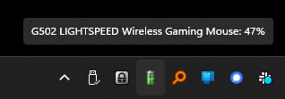

# LGBATTERY

System tray battery indicator for Windows Logitech devices. BECAUSE LOGITECH WON'T FOR SOME REASON.



## WHAT ITS DOING
It uses the Python websockets library to watch for battery changed notifications from LG Hub - yeah, sorry, you'll still need that.

It puts an icon in the system tray after extracting the battery level icons it needs from `C:\Windows\SystemResources\wpdshext.dll.mun` These are saved in `%APPDATA%\lgbattery`.

On first run it'll display the icon with a question mark until you right click the tray icon and select your device which will cause it to get the battery level immediately.

Battery level is shown as a tooltip on the system tray icon which also changes depending on the battery level.

After that it'll save the selected device in `%APPDATA%\lgbattery\config.ini` so it'll pick it up on restart.

if you want, you can add a `level_file` entry to the prefs. This will cause the battery level to be written to that file, in case you want to display it in 72pt **Trebuchet MS** on the desktop using the ([now dead](https://en.wikipedia.org/wiki/Samurize)) Samurize or something.

## PREFERENCES
Preferences are stored in `%APPDATA%\lgbattery\config.ini` as a regular INI file. entries are as follows, under the `[PREFS]` section.

|Name|Description|
|--|--|
|`selected_device`|Logitech ID for the device being monitored. Updated by the application when item selected from system tray rigt click|
|`level_file`|Full path to a text file that the application will create/update when the battery level changes|
|`log_level`|One of `DEBUG`, `INFO`, `WARNING` (default), `ERROR` or `CRITICAL` affecting the verbosity of logging.|
|`log_file`|File name (no path) for a text file to receive the logging output. File is created in `%APPDATA%\lgbattery`. If not present, logging is done to console.|

## IMPROVEMENTS
- The selected device is not ticked (checked: US) when selected. This is a limitation of the `infi.systray` library so if they add that functionality there I'll update this program.
- Linting 
- Security scan
- GitHub Actions

## CREDITS
Authors of all the libraries used (obviously) also @andyworld for [LGSTrayBattery](https://github.com/andyvorld/LGSTrayBattery/tree/master). I'd have just used that but it kept crashing for me, so I looked at the code as documentation for how to call the Logitech websockets API.

## APOLOGIES
There are probably many threading crimes committed in this code. I have zero experience with websockets or Python asyncio. Debug Duck is now in rehab.

---
## Build
Built on Python 3.12.0. From PowerShell:

```powershell 
.\.venv\Scripts\Activate.ps1
pip install -r .\requirements.txt
pyinstaller --hidden-import pkg_resources --hidden-import infi.systray --onefile --noconsole .\lgbattery.py
```
Then enjoy `.\dist\lgbattery.exe`

Refresh Pip dependencies with

```powershell
PS> pip freeze | %{$_.split('==')[0]} | %{pip install --upgrade $_}
```


## LGHUB API

From a combination of black-box poking about and the author cited above. SysInternals strings utility revealed these listed [endpoints](endpoints.md).

### Connecting to the API
1. Open a web socket to `ws://localhost:9010` with the following headers:

    |Header|Value|
    |--|--|
    |Origin|file://|
    |Pragma|no-cache|
    |Cache-Control|no-cache|
    |Sec-WebSocket-Extensions|permessage-deflate; client_max_window_bits|
    |Sec-WebSocket-Protocol|json|


### ENUMERATING DEVICES

1. Send the following request to get a list of devices:
    ```json
    {
        "msgId": "",
        "verb": "GET",
        "path": "/devices/list"
    }
    ```

Response is:
* an JSON array of objects, one per device under `message['payload']['deviceInfos']`.
* `message['payload']['deviceInfos'][]['capabilities']['hasBatteryStatus']` is `True` if the device has a battery that can be queried.
* `message['payload']['deviceInfpython -m venv .venv
os']['id']` seems not to be unique over time, so no good for saving which device is being monitored. Original release used this & was changed to use `extendedDisplayName` instead as user unlikely to have multiple instances of the same peripheral.

### WATCHING FOR BATTERY CHANGE

1. Send the following request:
It looks like the subscription is cancelled when you get a reply, so needs to be sent every time you get a response back, not just once at the start.
    ```json
    {
        "msgId": "",
        "verb": "SUBSCRIBE",
        "path": "/battery/state/changed"
    }
    ```

2. Receive the following response and parse
    ```json
    {
        "msgId": "50d84cf9-13c6-4376-83c9-01b4f0655915",
        "verb": "BROADCAST",
        "path": "/battery/state/changed",
        "origin": "backend",
        "payload": {
            "@type": "type.googleapis.com/logi.protocol.wireless.Battery",
            "deviceId": "dev00000007",
            "percentage": 74,
            "mileage": 24.9428902,
            "maxLifeSpan": 33.7066078,
            "charging": False,
            "consumption": {
                "value": 7.03438568,
                "details": {
                    "system": 5.92066669,
                    "sensor": 4.28,
                    "mcu": 1.64066672,
                    "roller": 0,
                    "reportRate": 0,
                    "lighting": 5.4763155,
                    "volume": 0
                },
                "useMw": True
            },
            "simpleBattery": False,
            "criticalLevel": False,
            "chargingError": False,
            "componentType": "INVALID_TYPE",
            "fullyCharged": False
        }
    }
    ```

    This response only has the `deviceId` which isn't unique over time, so when we save and load the prefs we use `extendedDisplayName`, then keep track of the selected device as an object which carries the `extendedDisplayName` and the `deviceId`